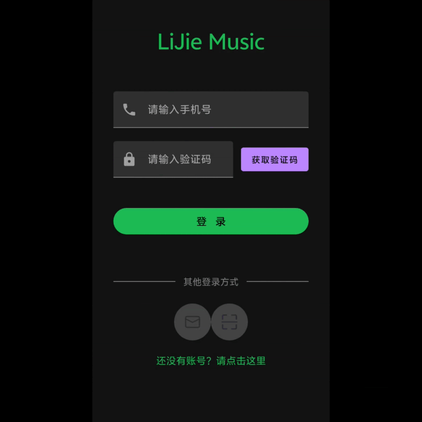
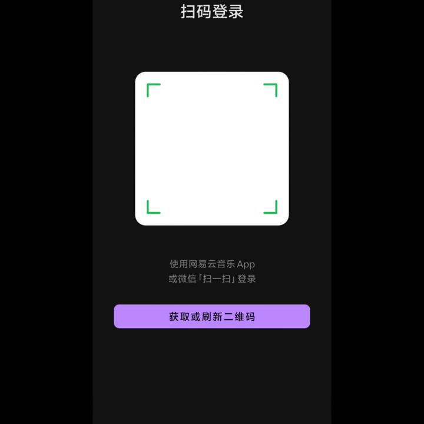
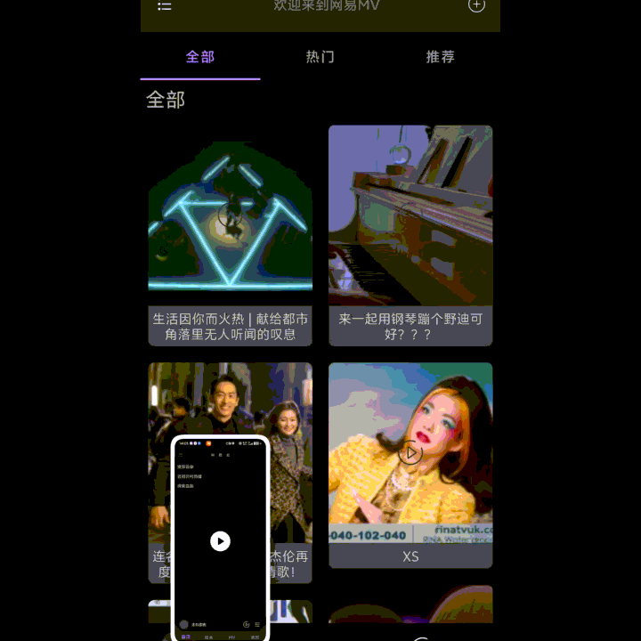

# README——李嘉豪

# LIJIEMUSIC

基于[网易云音乐 API Enhanced](https://music.generalsio.top/)开放API的多模块双人开发项目

写在前面说明一下，好像做GIF动图的时候分辨率没选好，导致上面有一小截被裁掉了（/\(ㄒoㄒ\)/\~\~），但又不是特别想重新录一遍了（哭），应该不是特别影响观看（实则是没招了）

## 功能概览

1. 听歌（搜索、歌单、我喜欢）

2. 动态

3. 登录

4. 首页、搜索页面等

5. MV

6. 歌词

## 技术栈

|类别|技术|
|---|---|
|语言|Kotlin 2\.1\.0|
|构建|Gradle9\.4\.1 AGP 9\.2\.1|
|最低版本|minSDK 24 targetSDK 36 CompileSDK 36|
|网络|Retrofit 2\.11\.0 okhttp 4\.12\.0|
|异步|协程kotlinx\-coroutines\-core 1\.9\.0|
|音乐|media3 1\.5\.1|
|图片|glide 4\.16\.0|
|视频|GSYVideoPlayer 9\.0\.0|
|调试|leakcanary\-android:2\.14|
|模块间解耦|TheRouter\+navigation2|

```Python
WanAndroid_Multi/
├── app/                          # 壳工程，组装所有模块，但也有部分功能实现在了app模块，如抽屉，小播放器         
├── core/
│   ├── base/                     #  BaseActivity · BaseFragment · BaseViewModel等
│   ├── therouter                 # 封装therouter的路径和参数
|   ├── net                       # 封装RetrofieClient，对外提供创建api的方法
│   ├── model                     # 许多模块公用的数据类    
│   └── util/                     # 工具类
├── feature/
│   ├── login/
│   ├── dynamics/                 #动态，通过抽屉点进去
│   ├── mv/  
│   ├── player/  
│   ├── playlist/  
│   ├── profile/ 
│   ├── search/                   # 搜索框点进去后的搜索页面
│   ├── searchPage/               # 底部导航栏对应的搜索页面                
│   └── home/
└── gradle/
    └── libs.versions.toml        # 版本目录（统一依赖管理）
```

## 架构设计（MVVM\)

多数模块的设计是定义model（大多数是网络请求所返回的JSON对应的数据），在ViewModel中发起网络请求，在View层（fragment、activity）观察。部分模块如播放器模块，逻辑设计比较绕。总体符合MVVM架构，但存在缺陷，如没有repository层。

## 我负责的模块及结果展示

其实很多模块都是两人都写了。

### :feature:login模块

游客、验证码、二维码三种登录方式

登录模块就是api比较多比较杂，然后还有Cookie的管理，






### :feature:player模块

我主要设计了播放界面UI（不过后续也被我搭档改了一点），然后还写了播放器底层（不过这一块用AI写的比较多）和LyricView，本来前面写着还行，不过后面因为歌词太长让AI加了个跑马灯。

然后歌词这个控件是自定义的LyricView，继承自View，重写了onDraw方法来画歌词。然后后续为了解决那个点击事件的冲突（点击事件1 切换歌词和封面 和 点击事件2 跳转歌词      的冲突），又重写了onTouchEvent方法。然后后面又发现了bug有的歌词太长了，词之长，一行塞不下呜呜呜\~\~\~，然后又写了个跑马灯（实则这块我根本不会写，是AI写的）。


### :feature:dynamics

简单的RV展示，然后没有歌分享的时候，将那个LinearLayout的Visibility设置成View\.GONE

\(其实是个壳子\)


### :feature:mv模块

写了两个mv页面和播放界面

筛选框是通过popupWindow实现的。然后这里的RV的adapter用的不是ListAdapter，是page3库的PagingDataAdapter。实现分页加载。然后这里本来的根布局是NestedScrollView，但是后面发现MV的数据过多，然后这个布局又会导致一次性加载所有RV，导致性能极差，因为MV很多，会越翻越卡，所以最后换成了ConstraintLayout，通过约束固定高度，而不是wrap\_content。（不过RV具体是怎么个复用机制我也不知道，感觉这个得去看源码）



### :feature:profile模块

写了头像关注粉丝还有歌单。粉丝和关注数目是接口有问题，有时候是对的有时候是错的。然后下面四个是空壳子。只有后面的歌单是能够点击的。

歌单的查看全部和查看部分是通过重写adapter的getItemCount\(\),并且双向监听，更新UI

```Kotlin
//通过重写getItemCount来返回控制的数目
override fun getItemCount(): Int {
    val initCount = super.getItemCount()
    if (isLimited) {
        return if (initCount <= 5) initCount else 5
    } else return initCount
}
```


### :feature:playlist模块

更换歌单封面、拖拽调序，左滑删除

歌单这里用的是NestedScrollView解决滑动冲突，不过这个也导致RV的复用机制失效，如果歌曲很多的话，有时候会变得卡顿一点。

然后rv的左滑拖拽是通过ItemTouchHelper\.Callback\(\)实现的

封面的切换用的是Android系统自带的系统级api

```Kotlin
private val pickImageLauncher = registerForActivityResult(
    ActivityResultContracts.GetContent() // 系统级 API：隐式 Intent 调用系统相册
) **{ **uri **->**
**    **uri?.*let ***{ **viewModel.uploadCover(playlistId.*toLong*(),**it**,requireActivity().*contentResolver*) **}**
**}**
```


注：上面的toast删除失败其实是成功了的，可能是接口的问题。封面更新后因为网速也需要过一段时间才能看到。

### :feature

feature模块还编写了一些其他的RV的点击事件，比如主页点击跳歌单（通过DeepLink传参），以及搜索的点击事件


### :core模块下

写了一些util类，以及公共要用的数据，如UserManager，管理用户的信息，TheRouter的统一路由参数管理（额，不过没怎么用上，可惜了）

## 糟糕

### 架构问题

感觉MVVM架构额，缺少repository层。

### 模块管理混乱

第一次写多模块，几乎是写到哪算哪。遇到了问题就问AI，然后AI提供的某些方法额，治标不治本，感觉最后整个模块就看起来非常乱。

### TheRouter没怎么用上

本来是想做单Activity，然后单Activity之中，多模块之间Fragment的跳转其实又很不一样。然后当时不知道，后面知道的时候就为时已晚，然后几乎没怎么用上。

# 心得

今天是7月28日，不知不觉，大一的一年度过去了，这一年经历了很多，思考过很多次学Android的意义是什么，为什么坚持。也遇到过很多困难，遭遇过不少瓶颈。也成功体验了盛夏40℃的CQ，额，突然想引用一句话，想，全是问题，做，才有答案。最后我做了，结果不论如何，那也是无愧于心的结果\.\.\.\.\.\.RedRock，感谢栽培，感谢每一位耐心解疑答惑的学长。


